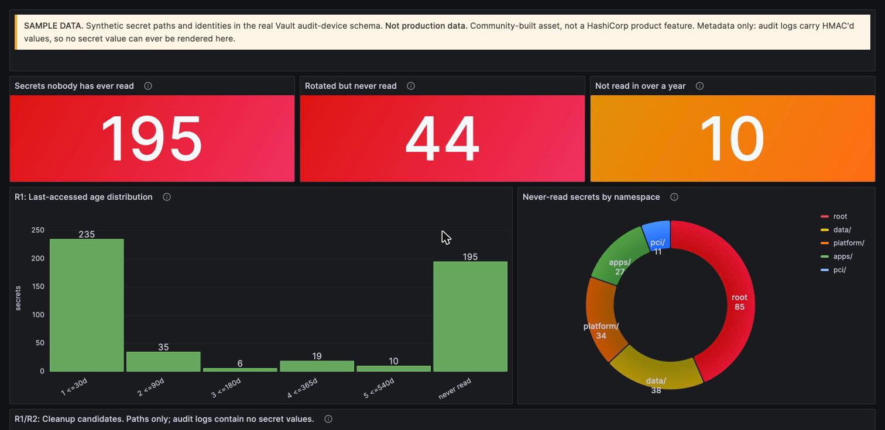
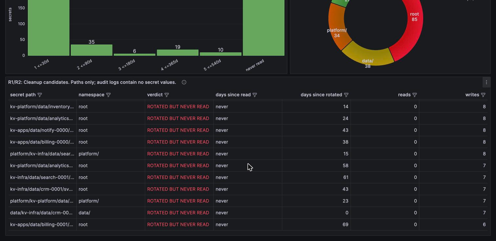

# vault-audit-dashboards

Splunk and Grafana dashboards that answer secret-hygiene questions about HashiCorp Vault by
folding the **audit device** stream. No tree walk, no plugin, no product feature required.

The question that started this:

> **How many secrets has nothing read in the last eighteen months?**

Vault can tell you a secret exists. It cannot readily tell you whether anything still *uses*
it. That answer is in the audit log, and it is derivable today in whichever tool you already
run.

---



## What you get

| | |
|---|---|
| 🔎 **Secrets nobody has ever read** | The dormant-cleanup list, including secrets that emit no audit event at all |
| 🔁 **Rotated but never read** | A rotation job faithfully rewriting a credential no workload has ever consumed. Pure waste, and invisible to any view that inspects secrets one at a time |
| 📊 **Last-read age distribution** | 30 / 90 / 180 / 365 / 540-day buckets, filterable by namespace |
| 👤 **Who read this secret** | Kubernetes service account, GitLab pipeline, source IP, when |
| 🧹 **Dead auth mounts** | Mounts that survived a platform decommission and are still taking logins |

Two implementations of the same answer, verified against the same dataset:

```
splunk/    SPL searches + a Simple XML dashboard
grafana/   Dashboard JSON, fed by scripts/vault-secret-aggregator.py
```

Pick whichever tool you already own. The numbers agree.

---

The cleanup list an auditor or platform owner actually acts on. Paths only; audit logs
contain no secret values:



Every row is a credential a rotation job is still faithfully rewriting that **nothing has
ever read**. One of them was rotated the same day.

## The two things everyone gets wrong

**1. Secret path can never be a label.** A large estate has hundreds of thousands of KV v2
secrets. Making path a Prometheus label or a Loki stream label means that many active
series, and it kills the index outright. The fold happens in a **stateful process**; only
aggregates cross the wire, and per-secret detail travels as log *lines*, never labels.

**2. "Never read" is invisible without a baseline inventory.** A secret nobody has read
emits *no audit event*. It cannot appear in any search over the audit index; it exists only
in a one-time path inventory. Skip that join and the single most important number is
silently missing, with no error to tell you.

Both are covered in [`docs/how-it-works.md`](docs/how-it-works.md).

---

## Quick start

```bash
# 1. Generate a realistic audit sample + baseline inventory (synthetic, deterministic)
cd splunk
python3 generate-sample.py --paths 500 --events 4000 --logins 1000 --out samples/audit.jsonl
python3 generate-sample.py --expected          # print the ground truth it should reproduce

# 2a. Splunk: load samples/audit.jsonl, then run splunk/r1-stale-secrets.spl
#     Full load runbook: splunk/README.md

# 2b. Grafana: fold and publish, no Splunk involved
cd ..
python3 scripts/vault-secret-aggregator.py \
    --audit     splunk/samples/audit.jsonl \
    --inventory splunk/samples/vault_secret_inventory.csv \
    --state-file .state/vault-secret-state.json \
    --print
```

`--print` needs nothing but Python 3 and stdlib. Add `--pushgateway` and `--loki` to publish
into Grafana.

Against a real cluster, point `--audit` at your audit device output instead.

---

## Verified

Three independent implementations, one dataset, 500 paths:

| | ≤30d | ≤90d | ≤180d | ≤365d | ≤540d | **never read** | **rotated but never read** |
|---|--:|--:|--:|--:|--:|--:|--:|
| Generator ground truth | 236 | 34 | 6 | 19 | 10 | **195** | 44 |
| Splunk SPL | 236 | 34 | 6 | 19 | 10 | **195** | **44** |
| Python aggregator | 235 | 35 | 6 | 19 | 10 | **195** | **44** |

The one secret that shifts between the 30d and 90d bucket is the clock advancing between
runs; that boundary is genuinely time-sensitive. `never read` and `rotated but never read`
are exact, and they are the two numbers that carry the story.

Splunk verified on Splunk Cloud 10.5. Grafana verified on 10.2.

---

## Safety

**Metadata only, by construction.** The Vault audit device HMAC-SHA256s every secret value
before it is written. No panel here can render a secret, because no secret value exists in
the input. That is what makes these searches safe to run against a regulated namespace.

**The sample data is synthetic.** Paths, namespaces, and identities are generated. The
*schema* is real, copied field-for-field from a live Vault audit entry, which is what the
searches actually exercise. Both dashboards carry a SAMPLE DATA banner as their first panel.
Don't crop it out of a screenshot.

---

## Status

A community-built asset, not a HashiCorp product feature and not a commitment about one.
It exists because the audit log already contains this answer and folding it is not hard.

Licensed under MPL-2.0.
