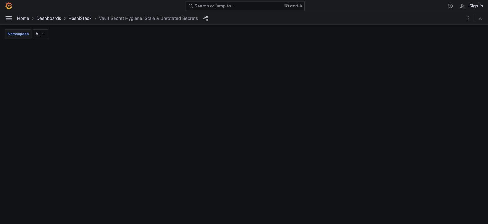
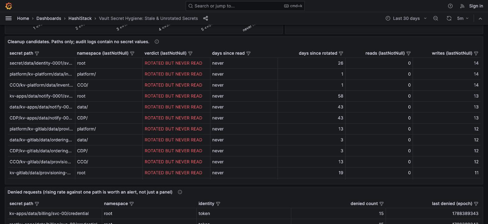

# Find stale secrets

> How many credentials has nothing read in eighteen months?

## Before you trust any number here: the baseline inventory

**A secret nobody has ever read emits no audit event.** It cannot appear in any Prometheus
gauge or Loki finding built from the audit stream. It exists only in a separate list of
every path in the estate.

Without `vault_secret_inventory.csv` passed to `--inventory`, the "never read" count is not
wrong in an obvious way. It is silently lower than the truth, with no error and no empty
panel. The aggregator warns on stderr when you omit it; it cannot warn from inside Grafana.

## Steps

1. Open the **Vault Secret Hygiene** dashboard
2. Pick a namespace, or leave the default
3. Read the three tiles, then the age distribution, then the cleanup table

## Reading the three tiles

| Tile | Metric | Means |
|---|---|---|
| **Secrets nobody has ever read** | `vault_secret_last_read_age{bucket="never read"}` | In the inventory, zero read events across the whole window |
| **Rotated but never read** | `vault_secret_verdict{verdict="rotated_but_never_read"}` | Something is writing it; nothing consumes it |
| **Not read in over a year** | `sum(vault_secret_verdict{verdict=~"dormant_over_365d\|dormant_over_540d"})` | Last read is older than 365 days |

## The finding that lands

**Rotated but never read** is the one to lead with.

Every row is a credential a rotation job is faithfully maintaining, on schedule, that no
workload has ever consumed. It is pure cost and pure risk surface, and it is invisible to
any tool that only checks rotation compliance: from that angle these secrets look perfectly
healthy.

Notice the column names: `namespace (lastNotNull)`, `reads (lastNotNull)`,
`writes (lastNotNull)`. That is not decoration, see **Why the columns say "lastNotNull"**
below.

## Why the columns say "lastNotNull"

Findings are pushed to Loki as log lines stamped now, not at the secret's last-read time.
Every fold run appends a fresh copy, so two folds inside the dashboard's time window would
show every secret twice without help.

The panel's transform pipeline groups rows by secret path and takes the most recent value
of every other field, so re-running the aggregator inside the same window still shows one
row per secret. The real fix is to stop using a log stream as a table (the aggregator's
state belongs in a database, queried directly); this transform is the practical workaround
until that exists. See `grafana/README.md` for the mechanics.

## Sanity check before quoting a number

The total secret count must equal your inventory's row count. If the dashboard total is
lower, the join is dropping rows. If the "never read" tile reads suspiciously low with no
inventory loaded, that is the silent-miss case above, not a healthy estate.

## Caching clients can invalidate the whole answer

⚠️ If your workloads use the External Secrets Operator, the Vault Secrets Operator, or any
sidecar that caches, a secret is read once per version and then served from cache. An
actively used credential can look untouched for months.

This does not make the dashboard wrong, but it changes what the number means: "nothing has
*fetched* this from Vault," not "nothing is *using* it." Establish how much of your estate
caches before putting this number in front of an auditor.
