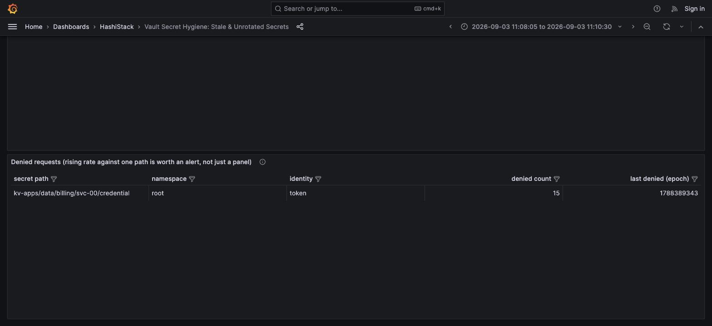

# Denied requests

> A rising denial count against one path is either a broken consumer or someone probing.
> Either way it is worth an alert, not just a panel.

## What counts as a denial

Any audit response carrying a non-empty `error` field. The aggregator checks this before
it ever looks at `request.operation`, so a denied read is never folded into read counts and
never marks a secret as accessed. It also never enters the hygiene table as a phantom
"never accessed" secret: a path someone merely probed and was denied against may not even
be a real, provisioned secret, and treating it as one would pollute the inventory-vs-audit
comparison that flags a stale baseline.

## Where the numbers go, and why they are split that way

| Data | Where | Why |
|---|---|---|
| Denial **count**, by namespace only | Prometheus counter `vault_secret_denied_total{namespace=...}` | Namespace-only cardinality, same rule as everything else in this tool: secret path can never be a label |
| Denial **detail** (path, identity, count, last seen) | Loki, as log lines | Per-secret and per-identity detail travels as line content, never as a label |

If you want an Alertmanager rule on a rising denial rate, alert on the Prometheus counter.
Use this panel to find out *who* and *what path* after the alert fires.

## Reading the panel

| Column | Means |
|---|---|
| **secret path** | The full namespace-relative path that was denied |
| **identity** | `auth.display_name` on the denied request |
| **denied count** | How many times, in this fold's window |
| **last denied** | Epoch seconds of the most recent denial |

A single identity denied many times against one path is almost always a misconfigured
consumer: an expired token still wired into a deploy, a policy that changed under a
workload nobody told. Many different identities denied against one path, in a short window,
reads differently: that is closer to a probe.

## What this cannot tell you

⚠️ **Source IP may not survive your load balancer.** If your ingress terminates TLS and
proxies to Vault, `request.remote_address` can carry the load balancer's address for every
request, not the true client. If that is your setup, do not build attribution logic on top
of it: every denial will appear to share one source, and that tells you nothing about who
is actually behind it. Confirm what your own ingress preserves before trusting this field.

The audit log also does not tell you *why* a request was denied beyond the error text
Vault provides (commonly "permission denied" or "invalid token"). It narrows the
investigation; it does not replace one.
