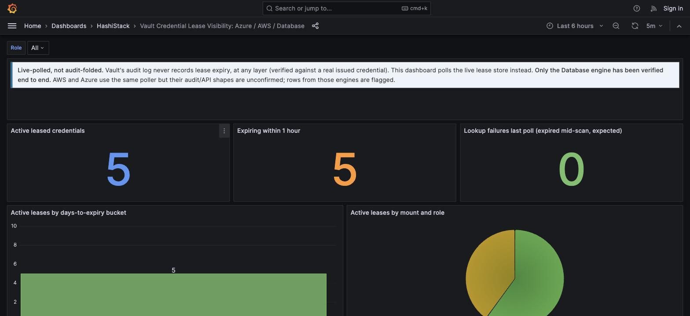
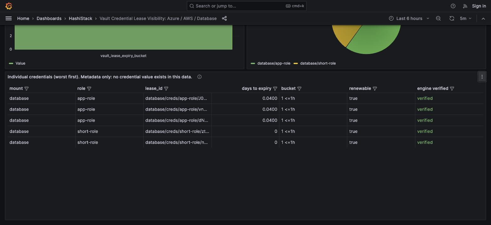

# Credential lease visibility (Azure / AWS / Database)

> When was this leased credential issued, and how many days until it expires?



## Why this is a separate tool, not an extension of the hygiene dashboard

Everything else in this repo folds the audit log. This one cannot, and that is not a
gap to close later, it is a property of the data.

**Verified against a real Vault, a real Postgres backend, and a real issued
credential:** the credential-issuance audit event carries no `lease_duration` or
`expire_time` at all, only a clear-text lease ID. The one API call that does return
expiry (`sys/leases/lookup`) HMACs that same lease ID in the audit log, both as input
and output, so it can never be joined back to the clear-text ID from issuance. A role's
configured TTL is HMAC'd too, on write. Expiry is not recoverable from the audit stream,
at any layer, by any join.

What does work: Vault's live API lets you list and inspect active leases directly, in
clear text. `grafana/scripts/vault-lease-inventory.py` polls that API instead of the audit log,
the same way the KV hygiene dashboard needs a one-time inventory walk for secrets that
emit no audit event: some questions can only be answered by asking Vault directly, not
by watching what already happened.

## Only Database has been proven



The `verified engine` column is not decoration. Only the `database` secrets engine has
been tested end to end: real Vault, real Postgres, real lease, real audit line read
directly off the wire. `aws` and `azure` are wired into the poller on the assumption
they issue credentials the same way (`<mount>/creds/<role>`, which is Vault's documented
default for both), but that assumption is unverified. A red `UNVERIFIED ENGINE` row
means exactly that: the number is a reasonable guess, not a proof.

## Running it

The poller lives at `grafana/scripts/vault-lease-inventory.py`. Splunk ships its own
separate copy at `bin/vault-lease-inventory.py` inside the app (scripted inputs can
only execute a script from the app's own `bin/`), so this one is the source of truth;
keep them in sync by hand if you change it. Run these from the repo root.

```bash
export VAULT_ADDR=https://vault.example.com:8200
export VAULT_TOKEN=...   # never pass this as a CLI argument, it lands in shell history

python3 grafana/scripts/vault-lease-inventory.py --engines database --print
python3 grafana/scripts/vault-lease-inventory.py --engines database \
    --pushgateway http://<host>:9091 --loki http://<host>:3100
```

**Run it on a schedule.** A lease expires on its own between polls; a one-time snapshot
goes stale within the shortest TTL in your estate. There is no equivalent to the KV
inventory's "walk it once and it stays valid" here.

## Reading the result

**High `active_leases` with a healthy days-to-expiry spread** is normal, expected
behavior for engines under load: dynamic credentials are supposed to churn.

**A cluster of leases all in the `<=1h` bucket at once** is worth a second look. Either
a lot of short-TTL work legitimately renews on a tight cycle, or something is
re-requesting credentials far more often than it should, which shows up here as volume
before it shows up as a cost or an audit-log-size problem.

**The `renewable` column** tells you whether a lease can be extended instead of
reissued. A workload that lets a renewable lease expire and requests a brand-new one
every time is generating unnecessary churn, and unnecessary churn is exactly the kind
of pattern this view exists to surface.

## What this cannot tell you

Who is currently *using* a credential, only that it exists and when it stops working.
"Who requested it" is answerable from the audit log (the issuance event carries
identity and the clear-text lease ID, see the repo's lease-visibility spec), but that is
a separate join this tool does not perform. And it cannot tell you whether Azure or AWS
attach their own native expiry semantics on top of the Vault lease; that is exactly the
open question the `UNVERIFIED ENGINE` flag exists to keep visible rather than paper over.
