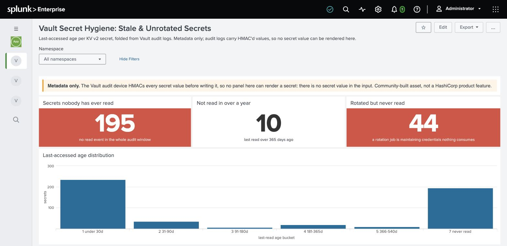
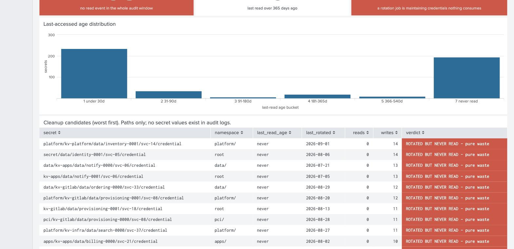
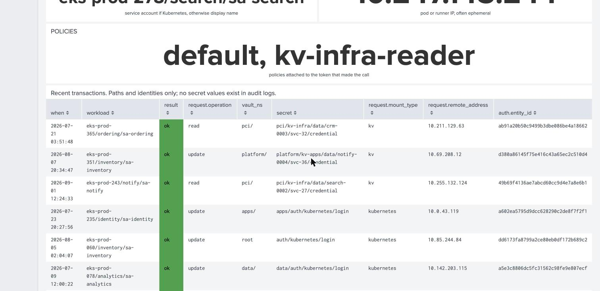

# Splunk

Everything on the Splunk side folds the Vault **audit device** stream. No Python, no
external process: the fold happens in SPL, inside Splunk.

## What is here

| Path | What it is |
|---|---|
| `splunk-app/vault_audit_hygiene/` | The drop-in app. Install this. |
| `dashboards/` | The same dashboard XML on its own, if you want to read or adapt it |
| `searches/` | The SPL on its own, heavily commented, one file per topic |

## Install

```bash
cp -r splunk-app/vault_audit_hygiene $SPLUNK_HOME/etc/apps/
$SPLUNK_HOME/bin/splunk restart
```

Copy `default/inputs.conf` to `local/inputs.conf`, point the monitor stanza at wherever
your shipper writes the audit log, and set `disabled = false`.

The searches assume `index=vault_audit sourcetype=vault:audit`. If yours differ, only the
first line of each search changes.

## The one thing you have to supply

`lookups/vault_secret_inventory.csv`, a one-time list of every secret path with columns
`secret,namespace,mount`.

This is not optional decoration. **A secret nobody has ever read emits no audit event**,
so it cannot appear in any search over the audit index. It exists only in that inventory.
Skip it and the single most important number on the hygiene dashboard is silently missing,
with no error and no empty panel: the count is simply lower than the truth.

Build it from a one-time KV metadata walk (`vault secrets list`, then recurse
`vault kv metadata list` per mount). It goes stale as secrets are created, so re-walk it
on whatever cadence matches how fast your estate changes.

## The dashboards

### Vault Secret Hygiene



Three headline tiles, an age distribution, and a cleanup table. **Rotated but never read**
is the number to lead with: a rotation job faithfully maintaining credentials that nothing
consumes.



Every row is a credential something is still writing to and nothing has ever read. Paths
only, because audit logs carry no secret values.

### Vault Transaction Trace


The pivot is workload identity, so `eks-prod-135/ordering/sa-ordering` names a thing you
can go and fix, rather than an IP that belonged to a pod that no longer exists.



### Vault Audit Volume Attribution


⚠️ Note the **request vs response** pie in that screenshot: a single slice. That is the
diagnostic working. A real audit device emits both types roughly 1:1, so one slice means
the shipper feeding it is dropping half the stream, and every volume number is half the
truth. Check that panel before reading any other number on the page.

## Walkthroughs

Step by step, with what each result means and where it can mislead you.

| | |
|---|---|
| [Who touched this secret?](scenarios/01-who-touched-this-secret.md) | Created, last written, last read, by whom |
| [Trace a transaction](scenarios/02-trace-a-transaction.md) | A secret out to its consumers, or a workload in to what it touched |
| [Find stale secrets](scenarios/03-find-stale-secrets.md) | The cleanup list |
| [Where is my audit volume coming from?](scenarios/04-where-is-my-audit-volume.md) | The filtering argument, with numbers |
| [Credential lease visibility](scenarios/05-credential-lease-visibility.md) | Azure/AWS/Database, live-polled not audit-folded. Only Database is verified |

## The searches

Each file starts with a numbered sanity check. Run that first: it tells you whether the
data is shaped the way the rest of the file assumes, before any number can mislead you.

| File | Answers |
|---|---|
| `stale-secrets.spl` | Last-read age per secret, the cleanup list, rotation age |
| `transaction-trace.spl` | Who read this secret, what has this workload touched, denials |
| `audit-volume-attribution.spl` | What is generating your audit ingest, and what is safe to filter |
| `secret-count-by-mount.spl` | Secret counts per mount and namespace, without a tree walk |
| `policy-trending.spl` | Policy operation rate, top policies, policy growth |
| `nightly-batch-spike.spl` | Time-of-day baseline, so on-call can tell normal from incident |
| `tls-noise.spl` | TLS handshake flooding, health checker versus scan |
| `lease-visibility.spl` | Leased credentials (Azure/AWS/Database): issued, expiring. Reads a different index; see below |

⚠️ **`tls-noise.spl` does not read the audit log.** TLS handshakes fail before Vault ever
writes an audit entry. It needs Vault *server* logs. Pointed at the audit index it renders
a permanently empty dashboard with no error, which is the most expensive kind of wrong.

## Two things that will silently give you a wrong answer

**The root namespace has no path.** In a real audit event the root namespace is
`"namespace": {"id": "root"}` with **no `path` key at all**. So this is required
everywhere a fully-qualified path is built:

```
| eval secret = coalesce('request.namespace.path',"") . 'request.path'
```

A bare `'request.namespace.path' . 'request.path'` yields null for every root-namespace
event and drops them all. No error. On one real cluster that was 17% of events.

**Single quotes mean different things in different commands.** In `eval` and `where` they
are a field reference and are required. In `stats ... BY`, `table`, `fields` and `top` they
are a literal string that matches nothing, so the column silently disappears:

```
| stats count BY 'request.operation'    <- 0 rows
| stats count BY request.operation      <- correct
```

## Credential lease visibility is a different pipeline

`lease-visibility.spl` does not read `index=vault_audit`. It reads `index=vault_leases`,
fed by a Splunk **scripted input** (`bin/vault-lease-inventory.py`, shipped with the
app) polling Vault's live API on Splunk's own schedule, because the audit log never
records a credential's expiry at any layer (verified). No external cron: Splunk runs
it and reads its stdout directly, and the Vault token lives in Splunk's own credential
store, never in a config file. See
[Credential lease visibility](scenarios/05-credential-lease-visibility.md) for the
finding and how to set it up. Only the `database` engine has been proven end to end.

## Scale

Aggregate at ingest, never at query time. A large estate has hundreds of thousands of KV
secrets, and any search whose cost scales with path cardinality will not survive contact
with it. The production form of the hygiene fold is a scheduled search writing to a summary
index with `collect`; each file's last section shows it.
