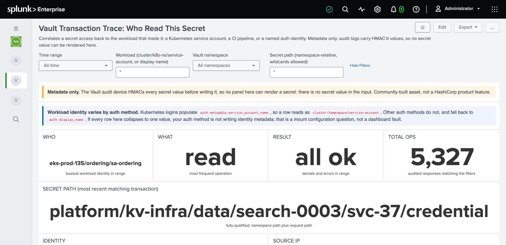

# Who touched this secret?

> Who created it, who last changed it, who last read it, and from where.

This is the question an auditor asks about a single credential, and the one that usually
gets answered with a shrug and a Slack thread.

## What the audit log can and cannot tell you

Be clear about this before you promise an answer, because three of these look identical
until you check.

| Question | Answerable? | Catch |
|---|---|---|
| Who **last read** it | ✅ Yes | None. Every read is an event |
| Who **last wrote** it | ✅ Yes | None |
| Who **created** it | ⚠️ Only sometimes | The first write emits `create`. If that happened before your audit retention window starts, the event is gone and no search will find it |
| **When** it was created | ✅ Yes, but not from audit | KV v2 metadata carries `created_time`. That is an API read, not a search |
| Who created it, when the event has aged out | ❌ No | Vault does not store a `created_by` on the secret. This is a known product gap, not a gap in these dashboards |

⚠️ **The trap is the third row.** A secret created four years ago, in an estate keeping
eighteen months of audit, has no creation event anywhere. A search will return "no create
event" and it is very easy to read that as "nobody created it" or "it was created outside
Vault". It means neither. It means your window does not reach back that far.

## Steps

### 1. Open the transaction trace dashboard

`Vault Audit Hygiene` app -> **Vault Transaction Trace**.

### 2. Put the secret path in the filter

Use the **Secret path** input. It is namespace-relative and takes wildcards, so
`*billing*` works if you do not have the full path to hand.

Leave **Workload** as `*`: you are asking about the secret, not about a client.

### 3. Read the tiles

The headline tiles resolve the last transaction against that path: who, what operation,
the result, the source IP, and which policies were in force.

### 4. Read the "Who reads this secret" panel



This is the one that answers the auditor's question, because it is not the last event, it
is every distinct consumer with a first-seen and last-seen timestamp.

## The full history in one search

The dashboard shows the common case. For the complete answer on one path, run this:

```
index=vault_audit sourcetype=vault:audit type=response
    request.mount_type=kv request.path="*<your-secret-path>*"
| eval secret = coalesce('request.namespace.path',"") . 'request.path'
| eval who    = coalesce('auth.metadata.service_account_name', 'auth.display_name', "unknown")
| stats
    min(eval(if('request.operation'=="create", _time, null())))                    AS created_at,
    values(eval(if('request.operation'=="create", who, null())))                   AS created_by,
    max(eval(if('request.operation' IN ("create","update"), _time, null())))       AS last_write,
    values(eval(if('request.operation' IN ("create","update"), who, null())))      AS writers,
    max(eval(if('request.operation'=="read", _time, null())))                      AS last_read,
    values(eval(if('request.operation'=="read", who, null())))                     AS readers,
    dc(eval(if('request.operation'=="read", who, null())))                         AS distinct_readers
  BY secret
| eval created_at = if(isnull(created_at), "NOT IN AUDIT WINDOW", strftime(created_at,"%F %T")),
       last_write = if(isnull(last_write), "no write in window", strftime(last_write,"%F %T")),
       last_read  = if(isnull(last_read),  "NEVER READ",         strftime(last_read,"%F %T"))
| table secret created_at created_by last_write writers last_read readers distinct_readers
```

## How to read the result

⚠️ **A missing column is a result, not a bug.** `table` drops any column that is null for
every row. If `created_by` does not appear at all, there were no `create` events in the
window. Verified: the same search returns 8 columns against data containing creations and
6 against data without them.


**`created_at = NOT IN AUDIT WINDOW`** does not mean the secret appeared from nowhere. It
almost always means the secret is older than your retention. Get the real creation time
from KV metadata instead:

```
vault kv metadata get -namespace=<ns> <mount>/<path>
```

That gives you `created_time`. It does not give you a `created_by`, because Vault does not
record one on the secret itself.

**`last_read = NEVER READ` with a recent `last_write`** is the finding worth escalating. A
rotation job is maintaining a credential that nothing consumes. See
[Finding stale secrets](03-find-stale-secrets.md).

**`distinct_readers` much higher than you expected** is a blast-radius problem. One
credential shared across many workloads means rotating it is a coordinated change, not a
routine one.

**`readers` empty but `writers` populated** is the same finding as NEVER READ, stated from
the other side.

## What to do with it

For an auditor, export the table (**Export** in the top right of the dashboard). The
`vault_auditor` role includes export capability precisely so an auditor can produce
evidence without asking an engineer to run a search for them.
