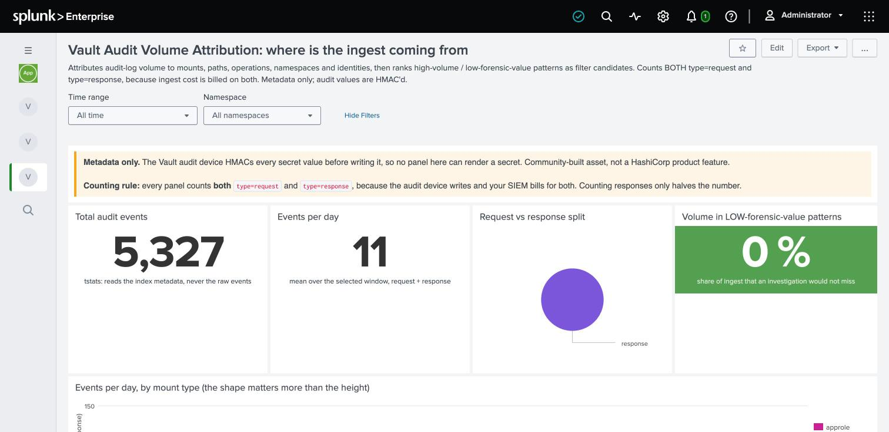

# Where is my audit volume coming from?

> Audit ingest is a top line on the SIEM bill and nobody can say what is generating it.

Filtering an audit stream is a security decision, so "let us drop some of this" is not an
argument you can win with an opinion. This turns it into a number.

## Steps

1. `Vault Audit Hygiene` -> **Vault Audit Volume Attribution**
2. **Run the request/response split panel first.** See below, it invalidates everything
   else if it is wrong
3. Work down: volume by mount, by operation, by namespace, then top talkers
4. Finish on the filter-candidates table

## Check this before reading any other number

A real audit device emits a `request` entry **and** a `response` entry, roughly 1:1. Your
SIEM bills for both.

⚠️ If the split panel shows only one type, your shipper is dropping half the stream. Every
volume number on the page is then half the truth, while looking entirely plausible. Fix the
pipeline before you use any of this in a cost conversation.

## The filter-candidates table

The money panel. It buckets paths by forensic value and shows each bucket's percentage of
total volume, so the argument becomes "these three patterns are sixty percent of our
ingest" rather than "the logs are too big".

Classic high-volume, low-value traffic: transit encrypt and decrypt on a batch pipeline,
token self-lookups, health checks.

## The panel that tells you the classifier is stale

The **what is inside "everything else"** panel shows traffic the classifier did not
recognise. An empty result means the classifier fits *your* data, not that it is complete.

⚠️ **Measured, and worth knowing:** against a synthetic corpus this panel was empty, 100%
classified. Against real audit data from two different clusters it was not: `kv` paths with
no `/data/` segment, plus `pki`, `ssh` and `aws` engine traffic, all fell straight through.
The classifier knows KV, auth, transit and sys. Re-run this panel whenever your source
changes.

## Before you filter anything

Three rules, in order:

1. **Fix it at the source first.** A misconfigured health check hammering Vault is a
   config bug, and filtering it hides the bug rather than solving it.
2. **Filter on emit, never at capture.** Capture everything at the audit device and filter
   on the way to the sink. Dropping at source means the event never existed and cannot be
   recovered during an incident.
3. **Never filter something because it is noisy.** Filter it because it has no forensic
   value. Those are different tests, and only the second one survives an audit.

⚠️ Index-time filtering in Splunk does not save licence volume: you are already billed by
the time the event reaches the indexer. Filter at the forwarder.
