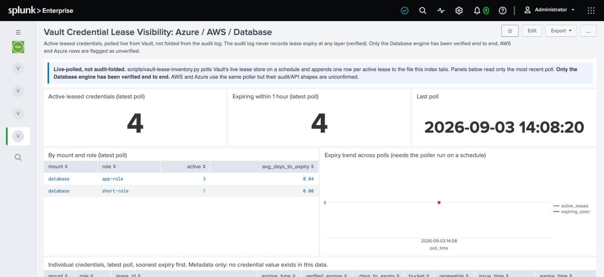
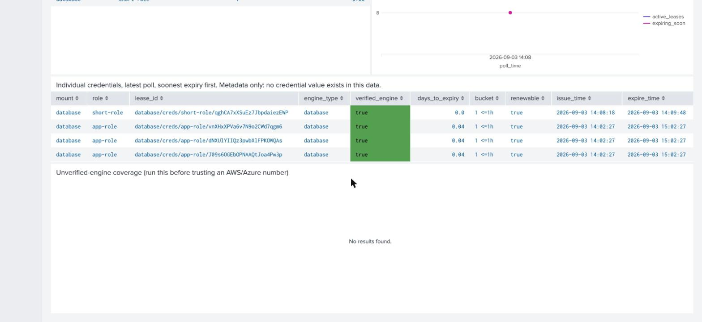

# Credential lease visibility (Azure / AWS / Database)

> When was this leased credential issued, and how many days until it expires?



## Why this needs a different pipeline entirely

Every other dashboard in this repo reads `index=vault_audit`. This one reads
`index=vault_leases`, fed by a live poller, not the audit device, and that is not a
style choice.

**Verified against a real Vault, a real Postgres backend, and a real issued
credential:** the credential-issuance audit event carries no `lease_duration` or
`expire_time` field at all, only a clear-text lease ID. The one call that does return
expiry (`sys/leases/lookup`) HMACs that same lease ID in the audit log, both as input
and output, so it can never be joined back to the clear-text ID from issuance. A role's
configured TTL is HMAC'd too. Expiry cannot be recovered from the audit stream by any
join, at any layer, full stop.

`bin/vault-lease-inventory.py` (shipped with this app) polls Vault's live lease API
instead (`LIST sys/leases/lookup/<mount>/creds/<role>/`, then a lookup per lease ID for
real `issue_time`/`expire_time`/`ttl`). The canonical source lives at
`grafana/scripts/vault-lease-inventory.py`; Splunk carries its own copy here because
scripted inputs can only execute a script from the app's own `bin/`. Same script,
kept in sync by hand.

## Install: Splunk runs the poller itself, no external cron

**Verified against a real Vault, a real Postgres backend, and a real Splunk 10.4.3
instance:** the app ships a Splunk **scripted input**. Splunk's own scheduler runs the
poller on the interval you set and reads its stdout directly as the event stream. No
cron, no systemd timer, no separate process for anyone to forget about.

1. Copy the app as usual (see the main [splunk README](../README.md)). `bin/vault-lease-inventory.py`
   comes with it; scripted inputs run from an app's own `bin/`.
2. Store the Vault token in **Splunk's own credential store**, once, via its REST API.
   It is encrypted at rest with the instance's own key; it never touches `inputs.conf`,
   an environment variable, or any file on disk in the clear:
   ```bash
   curl -k -u <splunk-admin>:<pw> \
     https://localhost:8089/servicesNS/nobody/vault_audit_hygiene/storage/passwords \
     -d name=vault_lease_poller_token -d realm=vault_audit_hygiene \
     -d password=<your-vault-token>
   ```
3. Copy `default/inputs.conf`'s scripted-input stanza to `local/`, set your real
   `--vault-addr` and `--engines` in the stanza name, set `disabled = false`.
4. Restart, or reload inputs. Splunk hands the script a fresh session key on every
   scheduled run (`passAuth = splunk-system-user`); the script uses it to pull the
   token back out of the credential store and poll Vault.

⚠️ **Splunk's `[script://...]` stanzas do not support a separate `args=` key.**
Command-line arguments go inside the stanza name itself, exactly as shown in the
shipped example. An `args=` line is silently ignored, the script runs with zero
arguments, and the resulting failure looks like a credential problem when it is
actually an inputs.conf syntax problem. Found by running it for real, not by reading
the docs.

**A lease expires on its own between polls.** There is no equivalent to the KV
baseline inventory's "walk it once and it stays valid" here; the interval on the
scripted input is what keeps this current.

## Only Database has been proven



The `verified_engine` column is not decoration. Only the `database` secrets engine has
been tested end to end. `aws` and `azure` are wired into the poller on the assumption
they issue credentials the same way Vault documents by default
(`<mount>/creds/<role>`), but that assumption is unverified. A red row means exactly
that: reasonable guess, not proof. Run **LV.5** (the "unverified-engine coverage"
search) before quoting an AWS or Azure number to anyone.

## Reading the dashboard

Every panel except the trend chart filters to the **latest poll only**
(`eventstats max(polled_at) | where polled_at=latest`). The file accumulates history
across polls, so reading it raw would show an expired lease from an hour ago as if it
were still active.

⚠️ **Do not rewrite this panel logic using SPL's `map` command.** An earlier version
did, and every panel using it hung forever showing "Search is waiting for input...",
even though the dashboard defines no inputs at all. The cause: `map`'s own
`$field$` token substitution uses the identical syntax Simple XML uses for dashboard
input tokens, and the dashboard layer greedily tries to substitute it first, waiting on
an input that does not exist. `eventstats`+`where` produces the same result without the
collision, and is simpler SPL besides.

## What this cannot tell you

Who is currently using a credential, only that it exists and when it stops working. The
audit log can tell you who requested it (the issuance event carries identity and the
clear-text lease ID), but that is a separate join this dashboard does not perform. And
it cannot tell you whether Azure or AWS layer their own native expiry semantics on top
of the Vault lease; that open question is exactly why the `verified_engine` flag exists
rather than presenting every engine with equal confidence.
